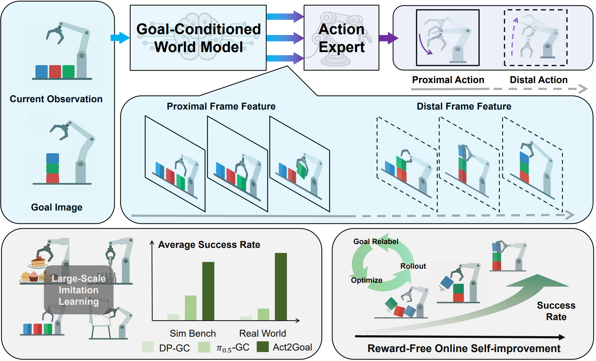
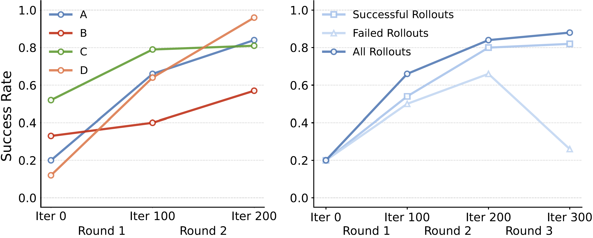

# Act2Goal

## From World Model to General Goal-conditioned Policy

Pengfei Zhou<sup>1*</sup>, Liliang Chen<sup>1*</sup>, Shengcong Chen<sup>1</sup>, Di Chen<sup>1</sup>,  
Wenzhi Zhao<sup>1</sup>, Rongjun Jin<sup>1</sup>, Guanghui Ren<sup>1</sup>, Jianlan Luo<sup>1†</sup>

<sup>1</sup> Agibot Research

[Arxiv](http://arxiv.org/abs/2512.23541) · [About Us](https://www.agibot.com/research/)

---

## Project Video

[Watch project video](./web_videos/PR_video.mp4)

---

## System Overview



*System overview of Act2Goal*

---

# Generalization

Real-world scenarios that are difficult to specify precisely via language and require fine-grained control for successful execution.

## In-Domain

### Write_ID
The robot writes the English word shown in the goal image on a whiteboard using a marker pen.  
[Video](./web_videos/WRITE_ID.mp4)

### Dessert_ID
The robot performs dessert plating with reference to a given goal image.  
[Video](./web_videos/DESSERT_ID.mp4)

### Plug_In_ID
Following the goal image's guidance, the robot picks up bearing workpieces and inserts them into small holes one by one.  
[Video](./web_videos/Plug_ID.mp4)

## Out of Domain

### Write_OOD
The robot writes words unseen during training on a whiteboard using a marker pen.  
[Video](./web_videos/WRITE_OOD.mp4)

### Dessert_OOD
The robot performs dessert plating with reference to a given goal image, using a plate and dessert types unseen in the training data.  
[Video](./web_videos/DESSERT_OOD.mp4)

### Plug_In_OOD
The robot completes a plug-in task unseen in training: inserting a cylindrical drink bottle into a cup holder.  
[Video](./web_videos/Plug_OOD.mp4)

## Real-World Tasks Results

| Split | Model/Task | Whiteboard Word Writing | Dessert Plating | Plug-In Operation |
|---|---|---:|---:|---:|
| ID | DP-GC | 0.00 | 0.10 | 0.00 |
| ID | π<sub>0.5</sub>-GC | 0.23 | 0.18 | 0.00 |
| ID | HyperGoalNet | 0.00 | 0.08 | 0.00 |
| ID | **Act2Goal** | **0.93** | **0.75** | **0.45** |
| OOD | DP-GC | 0.00 | 0.00 | 0.00 |
| OOD | π<sub>0.5</sub>-GC | 0.20 | 0.05 | 0.00 |
| OOD | HyperGoalNet | 0.00 | 0.00 | 0.00 |
| OOD | **Act2Goal** | **0.90** | **0.48** | **0.30** |

## Simulated Benchmarks

Four tasks from the RoboTwin 2.0 benchmark with both easy (no noise) and hard (with noise) environment settings.

| Split | Model/Task | Move Can | Pick Bottles | Place Cup | Place Shoe |
|---|---|---:|---:|---:|---:|
| Easy | DP-GC | 0.18 | 0.04 | 0.03 | 0.04 |
| Easy | π<sub>0.5</sub>-GC | 0.54 | 0.13 | 0.16 | 0.30 |
| Easy | HyperGoalNet | 0.11 | 0.08 | 0.08 | 0.01 |
| Easy | **Act2Goal** | **0.62** | **0.80** | **0.64** | **0.52** |
| Hard | DP-GC | 0.00 | 0.00 | 0.00 | 0.00 |
| Hard | π<sub>0.5</sub>-GC | **0.42** | 0.06 | 0.04 | 0.06 |
| Hard | HyperGoalNet | 0.00 | 0.00 | 0.00 | 0.00 |
| Hard | Act2Goal | 0.13 | **0.43** | **0.13** | **0.15** |

---

# Autonomous Improvement

Rapid improvement of success rate by online training.

## Real-World Examples

### Drawing Unseen Pattern 1
The robot learns to draw a cross (unseen pattern in training) through 27-min of online training.  
[Video](./web_videos/OA-drawing unseen_short.mp4)

### Drawing Unseen Pattern 2
The robot learns to draw a paper clip (unseen pattern in training) through 20-min of online training.  
[Video](./web_videos/OA-drawing unseen2.mp4)

### Plug bottle into cup holder
The robot learns to accurately place beverages into cup holders through 17-min of online training.  
[Video](./web_videos/OA-plug bottle cup holder.mp4)

## Simulated Benchmarks

Online-training effectiveness test in the Robotwin Simulator.  
Figure on the left shows success rates improvement for all four challenging scenarios.  
Figure in the middle shows success rates improvement for different replay buffer settings.  
Video on the right demonstrates the progress of the robot's movements during online simulation learning.

(A: Move Can Pot, B: Pick Bottles, C: Place Cup, D: Place Shoe)



[Simulation video](web_videos/OA-OOD sim tasks.mp4)

---

# Ablation Study for Multi-Scale Temporal Hashing

The MSTH-based prediction strategy significantly outperforms the widely-used fixed-horizon action chunking approach in goal-conditioned tasks, particularly for long-horizon scenarios.

| Split | Model | Short | Medium | Long |
|---|---|---:|---:|---:|
| ID | w/o MSTH | 0.95 | 0.35 | 0.10 |
| ID | **w/ MSTH** | **0.95** | **0.90** | **0.90** |
| OOD | w/o MSTH | 0.60 | 0.20 | 0.00 |
| OOD | **w/ MSTH** | **0.93** | **0.90** | **0.88** |

## Goal-conditioned Video generation via MSTH

The video is divided into two parts: <span style="color: blue">a short-horizon proximal segment</span> with densely and uniformly sampled future states for fine-grained dynamics, and <span style="color: red">a long-horizon distal segment</span> with logarithmically spaced samples from the remaining path to the goal, enabling coarser, goal-directed planning.

### Case 3
[Video](web_videos/case3.mp4)

### Case 4
[Video](web_videos/case4.mp4)

### Case 5
[Video](web_videos/case5.mp4)

---

# AgiBot Research

Committed to advancing frontier research in embodied artificial intelligence, enabling robots to truly understand and adapt to complex physical worlds.

## Citation

```bibtex
@misc{zhou2025act2goalworldmodelgeneral,
      title={Act2Goal: From World Model to General Goal-conditioned Policy},
      author={Pengfei Zhou and Liliang Chen and Shengcong Chen and Di Chen and Wenzhi Zhao and Rongjun Jin and Guanghui Ren and Jianlan Luo},
      year={2025},
      eprint={2512.23541},
      archivePrefix={arXiv},
      primaryClass={cs.RO},
      url={https://arxiv.org/abs/2512.23541},
}
