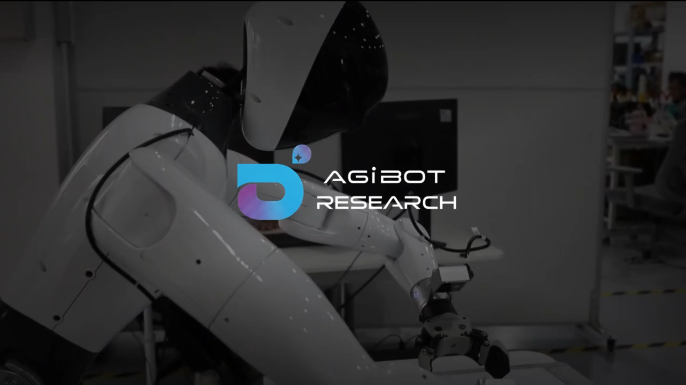

# Act2Goal

## From World Model to General Goal-conditioned Policy

  Pengfei Zhou1*, Liliang Chen1*, Shengcong Chen1, Di Chen1 
  Wenzhi Zhao1, Rongjun Jin1, Guanghui Ren1, Jianlan Luo1†

1 Agibot Research

  <a href="http://arxiv.org/abs/2512.23541"><strong>Arxiv</strong></a>
  &nbsp;·&nbsp;
  <a href="https://www.agibot.com/research/"><strong>About Us</strong></a>

---

## Project Video

  

<em>Click the image above to watch the project video.</em>

